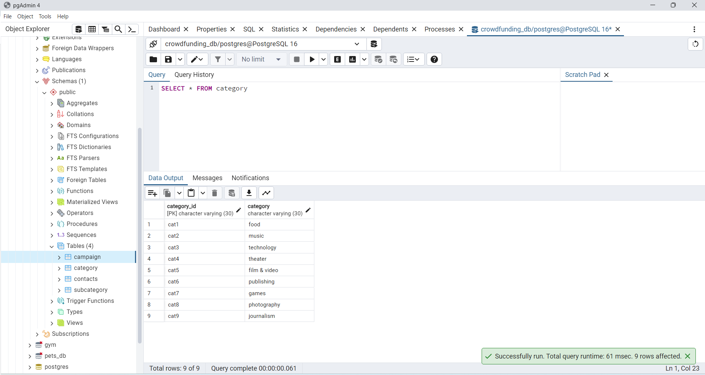
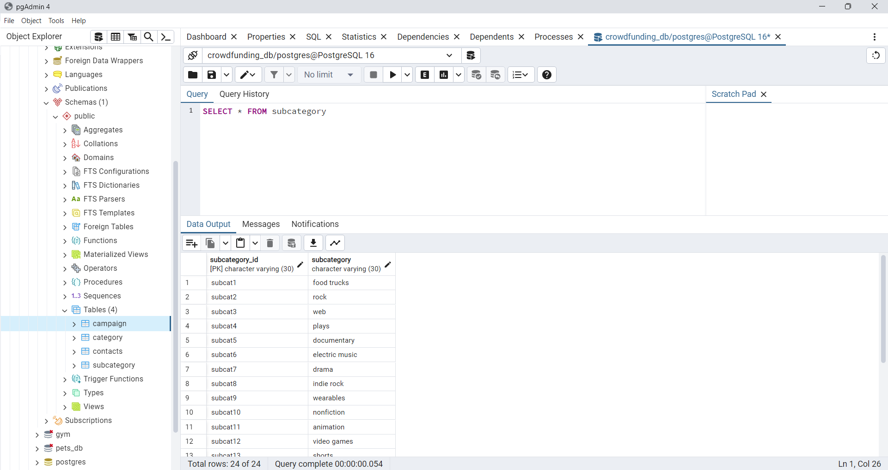
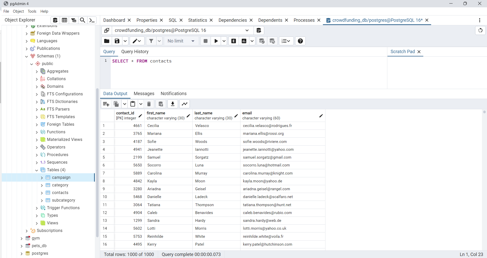

# Crowdfunding_ETL

# Project Overview

This project involved building an ETL pipeline using Python, the Pandas library, and Python dictionary methods to extract and transform the data. After the data was transformed, four CSV files were exported, and the CSV file data was used to design an Entity-Relationship Diagram (ERD) and a table schema. Finally, the CSV data files were uploaded into PostgreSQL via pgAdmin. Once the data was loaded, Exploratory Data Analysis (EDA) was conducted, both to test the success of the data imports and table schema, as well as to get initial insights about the data.

The screenshots of the data are posted into the Github, including the Jupyter Notebook for data cleaning and transformation.

### References for the project notebook:

Cell 29 of 48, json.loads():
https://www.geeksforgeeks.org/python-convert-string-dictionary-to-dictionary/

Cell 32 of 48, df[column_name].str.split(expand=True)
https://pandas.pydata.org/docs/reference/api/pandas.Series.str.split.html

Data for this dataset was generated by edX Boot Camps LLC, and is intended for educational purposes only.
